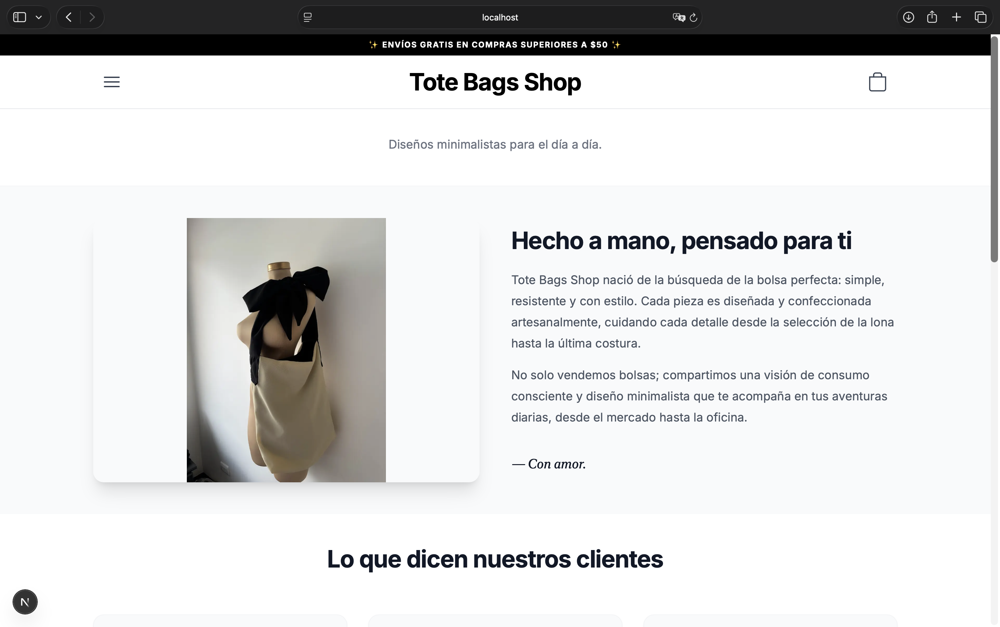
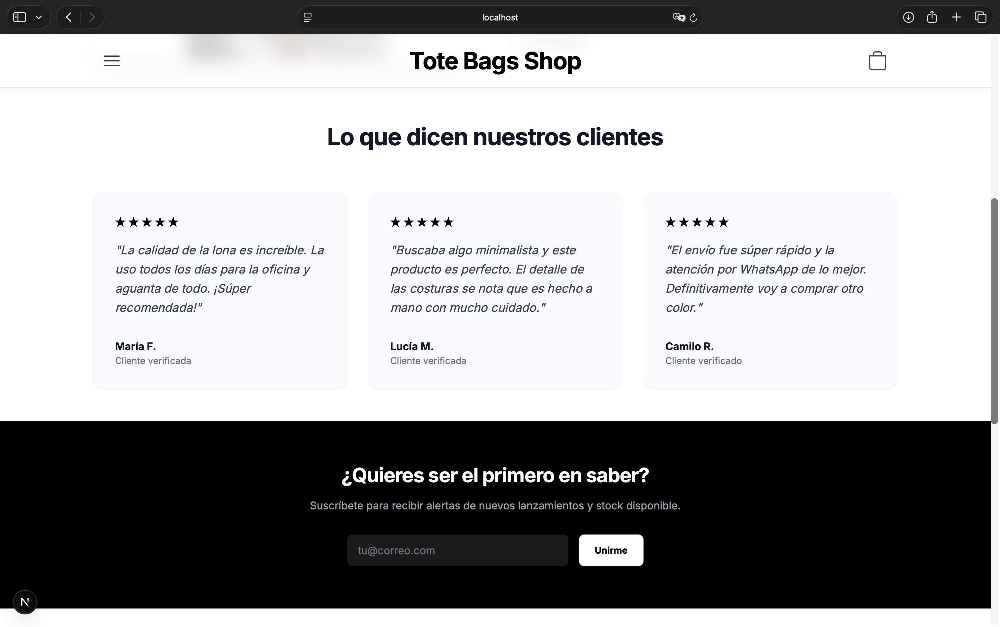
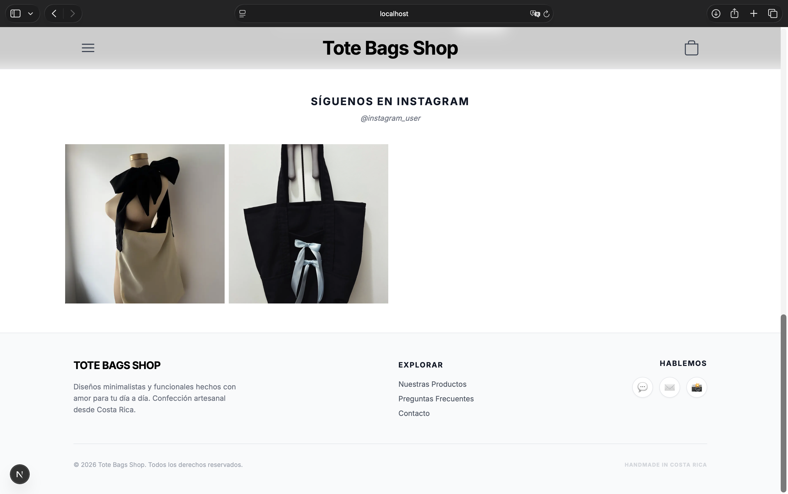
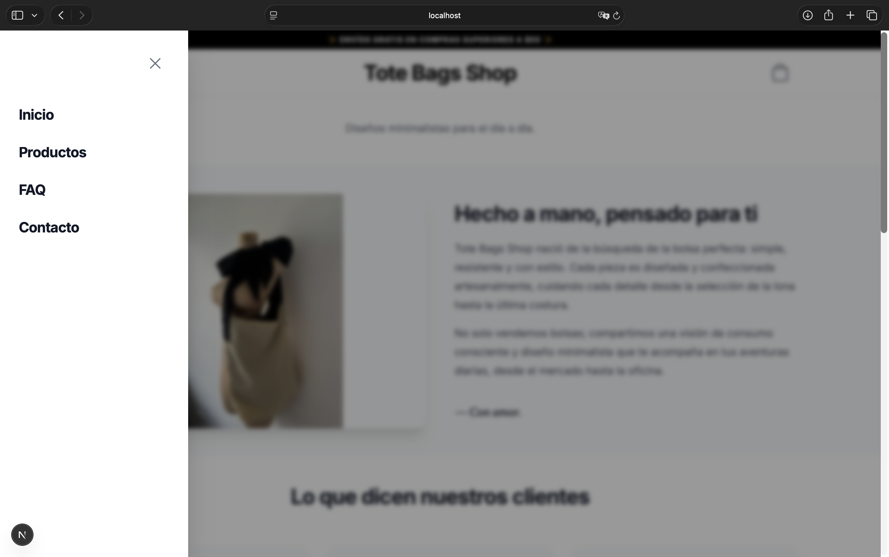
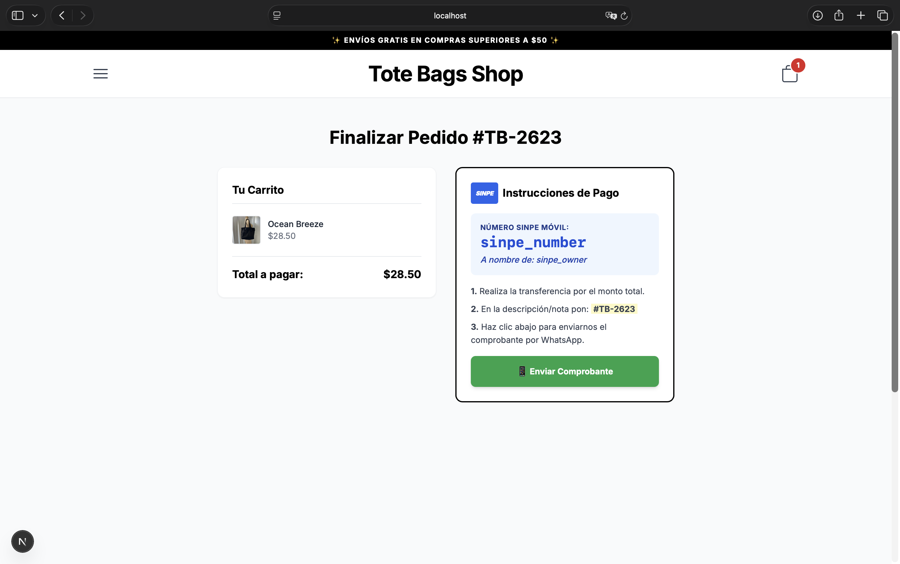

# Tote Bags Shop - E-commerce Platform 🇨🇷

A high-performance, mobile-first e-commerce application tailored for the Costa Rican market. Built with a focus on Site Reliability Engineering (SRE) principles: scalability, clean state management, and seamless user experience.

## 🚀 Features
- **Dynamic Product Catalog:** Responsive grid layout with category filtering.
- **Optimized Shopping Cart:** Real-time state management using React Context API.
- **SINPE Móvil Integration:** Custom checkout flow generating unique Order IDs and automated WhatsApp notification strings.
- **Mobile-First Design:** Fully responsive UI built with Tailwind CSS.

## 🛠️ Tech Stack
- **Frontend:** Next.js (App Router), TypeScript, Tailwind CSS.
- **State Management:** React Context API.
- **Deployment (Planned):** Google Cloud Platform (Cloud Run, Firestore, Cloud Build).

## 📈 Architecture & SRE Principles
This project follows a decoupled architecture to allow for future migrations. 
- **Idempotency:** Unique Order IDs (#TB-XXXX) ensure payment reconciliation is error-free.
- **User Experience:** Encoded URI strings for WhatsApp integration to reduce customer friction.
- **Scalability:** Container-ready structure for GCP deployment.

## Home Page:

## Hamburger Menu

## Products section

## Shopping Bag

## Checkout

## Thank You

## FAQ

## Contact
